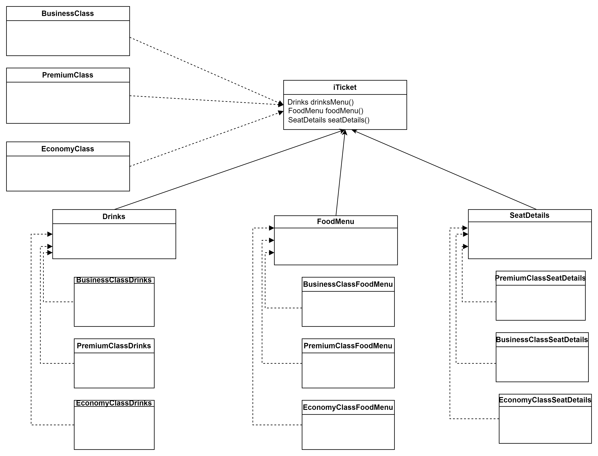

Abstract Factory Design Pattern:
----------------------
Create a ticketing system of a plane.
1. The plane has 3 types of seats: Premium, Business and Economy
2. Each seat types have their own Food menu, drinks menu and seat types.
